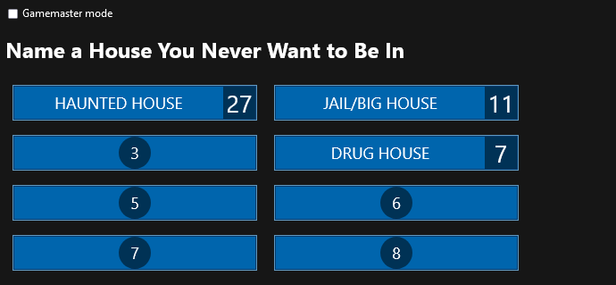
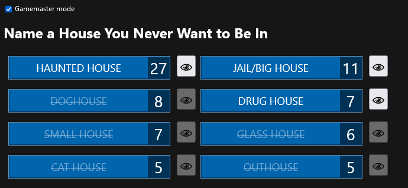

This is a simple Family-Feud-like board, originally developed for use in interactive streams by [RadiantSoul_Tv](https://www.twitch.tv/radiantsoul_tv).
It runs locally, and the non-gamemaster view is meant to be presented visually to participants (e.g. streamed).




It's bundles as an HTTP server executable that offers its UI as a website.
The board's state is synchronized between all tabs by going through the server.

## Technical details

### Making a release build

You need to first build the frontend using `npm run build` from the `svelte-frontend` directory,
because the `rust-backend` expects the frontend to lie under `../svelte-frontend/dist/`.
There is no automatism for that right now.
After that, you can run `cargo build --release` from the `rust-backend` directory,
and your release build will be at e.g. `target/release/family-feud.exe`.

### Technologies used

The frontend is written in TypeScript using [Svelte](https://svelte.dev/) as the framework.  
The backend is written in Rust using [Tide](https://github.com/http-rs/tide) as an HTTP server.

Both were chosen arbitrarily because I wanted to try them out. 
In retrospect, Svelte feels like a very pleasant choice, but Rust feels overkill.
The language is very nice, but too complicated for this thing (especially since async is involved).

### state synchronization

The state between all instances of the website is synchronized by having all state changed go through the server.
There's no kind of client-side "optimistic state", the GUI state only ever changes when the server sends new data.

These things are involved:
- GUI State that needs to be synchronized uses a [custom store](https://svelte.dev/docs/svelte/stores#Store-contract).
  See [remotestore.ts](svelte-frontend/src/remotestore.ts) for its implementation.
- The DOM is used as an event bus for the mentioned custom store.
  Writing to the store gets replaced by triggering a `remotestore_send` event,
  and `remotestore_recv` events cause the store to change value.
- Hooking said DOM events up to the server is done using a WebSocket.
  All `remotestore_send` events get sent to the websocket,
  and all data received on the websocket gets turned into a `remotestore_recv` event.
- On the backend, all client-server shared state is handled using [futures-signals](https://crates.io/crates/futures-signals).
  This just means all state changes are observed and automatically sent out over the WebSocket.

This is quite a lot, but once it's set up, client-server state management becomes trivial.
You can just mutate stuff and it stays in sync across the client and server:
```rust
let title: Mutable<String> = Mutable::new("Default Title".to_string());
// ... requires some copy-pasta to hook up to WebSockets
title = "Something New";  // state change is automatically broadcast
```
```typescript
const title: Writable<string> = createRemoteStore("title");
// ...
$title = "Something New"; // state change automatically goes through the server
```
